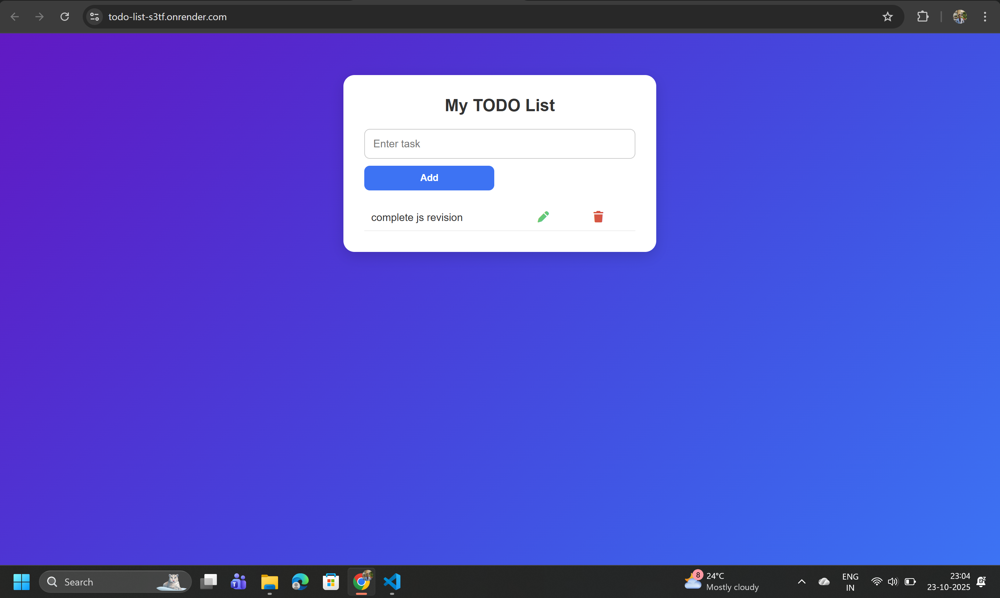

# 📝 TODO List App

A simple and elegant **To-Do List Web App** built using **HTML, CSS, and JavaScript**.  
It helps users **add**, **edit**, **update**, and **delete** daily tasks — all stored securely in your **browser’s local storage** so your data never disappears after refresh.

---

## 🌐 Live Demo

🔗 **[👉 Click Here to View Live](https://todo-list-s3tf.onrender.com)**

---

## 🚀 Features

- ✅ Add new tasks quickly  
- ✏️ Edit and update existing tasks  
- 🗑️ Delete tasks anytime  
- 💾 Auto-saves tasks using `localStorage`  
- 🎨 Clean and responsive UI design  
- 📱 Works perfectly on mobile and desktop devices  

---

## 🧠 Tech Stack

| Technology | Role |
|-------------|------|
| **HTML5** | Base structure |
| **CSS3** | Styling & layout |
| **JavaScript (ES6)** | Functionality & DOM manipulation |
| **Font Awesome** | Modern action icons (edit/delete) |

---

## 💡 How It Works

1. Enter a task in the input field and click **Add**.  
2. Your task appears in the task list table.  
3. Click ✏️ to edit or 🗑️ to delete a task.  
4. Changes are automatically stored in **localStorage**.  

---

## 🖼️ UI Preview

---

