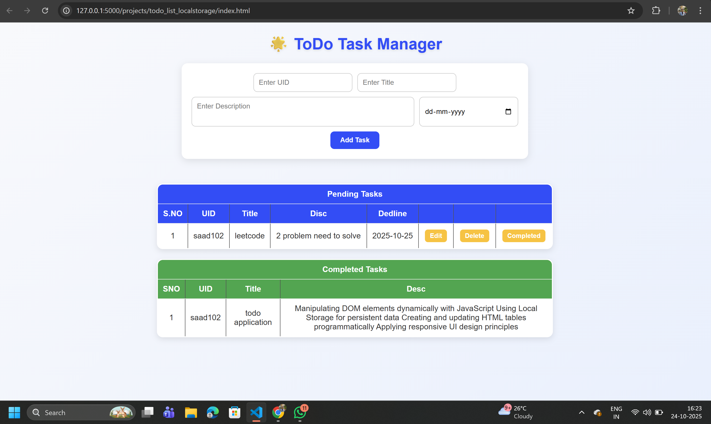

# 📝 To-Do Task Manager (Web App)

A simple, elegant **To-Do Task Manager** built using **HTML, CSS, and JavaScript** with **Local Storage** for data persistence.  
This project helps users add, edit, delete, and manage tasks efficiently — with a clear separation between **Pending** and **Completed** tasks.

---

## 🌐 Live Demo

🔗 **[👉 Click Here to View Live](https://todo-application-xcno.onrender.com)**

## 🌟 Features

- ✅ Add new tasks with:
  - Unique **UID**
  - Task **Title**
  - Task **Description**
  - **Deadline** date
- ✏️ Edit existing tasks
- 🗑️ Delete unwanted tasks
- ✔️ Mark tasks as **Completed**
- 📦 Automatically saves all tasks in **Local Storage**
- 🧭 Displays both **Pending** and **Completed** task lists separately
- 💎 Clean and responsive **UI design**
- 🔁 Update tasks anytime without page reload

---

## 🖥️ Tech Stack

| Category | Technologies Used |
|-----------|-------------------|
| **Frontend** | HTML5, CSS3, Vanilla JavaScript |
| **Storage** | Browser Local Storage |
| **Styling** | Custom modern CSS with gradients, shadows, and responsive layout |

## 🧾 Project Screenshot

---

